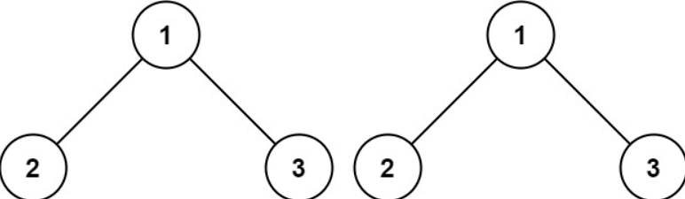
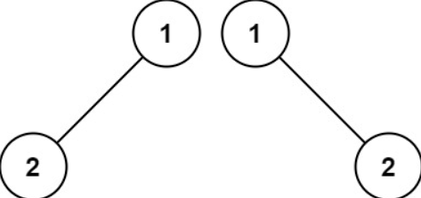
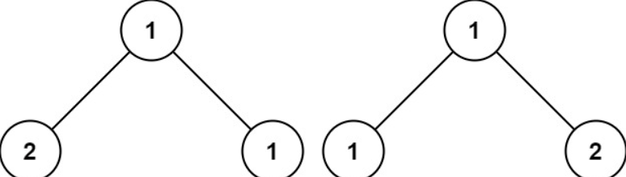

# [LeetCode 100. Same Tree](https://leetcode.com/problems/same-tree/description/?envType=daily-question&envId=2024-02-23)

## Problem Description

Given the roots of two binary trees `p` and `q`, write a function to check if they are the same or not.

Two binary trees are considered the same if they are structurally identical, and the nodes have the same value.

### Examples

#### Example 1:

Input: `p = [1,2,3], q = [1,2,3]`

Output: `true`

#### Example 2:

Input: `p = [1,2], q = [1,null,2]`

Output: `false`

#### Example 3:

Input: `p = [1,2,1], q = [1,1,2]`

Output: `false`

## Constraints

- The number of nodes in both trees is in the range `[0, 100]`.
- `-10^4 <= Node.val <= 10^4`
