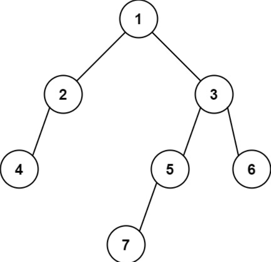

# [513. Find Bottom Left Tree Value](https://leetcode.com/problems/find-bottom-left-tree-value/description/)

## Problem Description

Given the root of a binary tree, return the leftmost value in the last row of the tree.

### Examples

#### Example 1:

Input: `root = [2,1,3]`

Output: `1`

#### Example 2:

Input: `root = [1,2,3,4,null,5,6,null,null,7]`

Output: `7`

## Constraints

- The number of nodes in the tree is in the range `[1, 104]`.
- `-231 <= Node.val <= 231 - 1`
