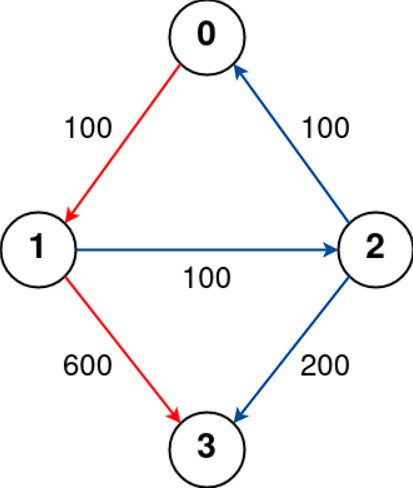
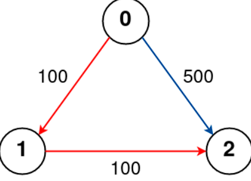
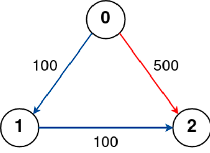

# [787. Cheapest Flights Within K Stops](https://leetcode.com/problems/cheapest-flights-within-k-stops/description/?envType=daily-question&envId=2024-02-23)

## Problem Description

There are n cities connected by some number of flights. You are given an array `flights` where `flights[i] = [from i, to i, price i]` indicates that there is a flight from city `from i` to city `to i` with cost `price i`.

You are also given three integers `src`, `dst`, and `k`, return the cheapest price from `src` to `dst` with at most `k` stops. If there is no such route, return -1.

### Examples

#### Example 1:

Input: `n = 4, flights = [[0,1,100],[1,2,100],[2,0,100],[1,3,600],[2,3,200]], src = 0, dst = 3, k = 1

Output: `700`

Explanation:
The graph is shown above.
The optimal path with at most 1 stop from city 0 to 3 is marked in red and has cost 100 + 600 = 700.
Note that the path through cities [0,1,2,3] is cheaper but is invalid because it uses 2 stops.

#### Example 2:

Input: `n = 3, flights = [[0,1,100],[1,2,100],[0,2,500]], src = 0, dst = 2, k = 1

Output: `200`

Explanation:
The graph is shown above.
The optimal path with at most 1 stop from city 0 to 2 is marked in red and has cost 100 + 100 = 200.

#### Example 3:

Input: `n = 3, flights = [[0,1,100],[1,2,100],[0,2,500]], src = 0, dst = 2, k = 0

Output: `500`

Explanation:
The graph is shown above.
The optimal path with no stops from city 0 to 2 is marked in red and has cost 500.

## Constraints

- `1 <= n <= 100`
- `0 <= flights.length <= (n * (n - 1) / 2)`
- `flights[i].length == 3`
- `0 <= from i, to i < n`
- `from i != to i`
- `1 <= price i <= 10^4`
- There will not be any multiple flights between two cities.
- `0 <= src, dst, k < n`
- `src != dst`
